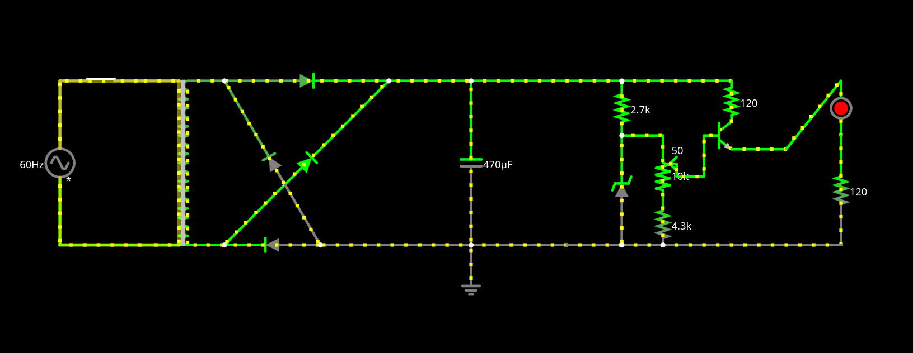
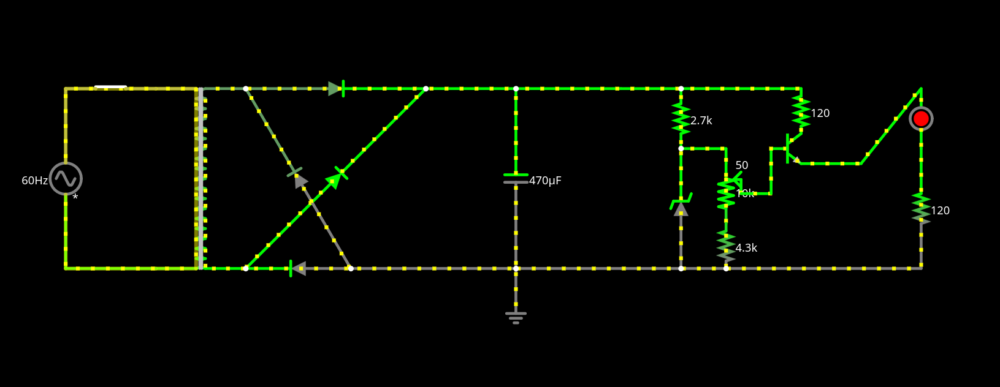

# Fonte de Tensão Ajustável
## Descrição da Atividade

Construção de uma fonte de tensão retificadora ajustável entre 3V e 12V com capacidade de 100mA. 

O circuito será feito a partir de uma corrente alternada de 127V (pico de 180V) de 60Hz.

## Alunos

* Bruno Kioshi Otani - 16858174

* Luis Aires Coimbra - 15472565

## Tabelas de Gastos

| Quantidade | Componente | Descrição | Valor Unitário |
|----------|----------|----------|----------|
| 1 | Protoboard | 840 pontos de conexão | R$ 39,10 |
| 1 | Kit Jumper | Macho-Macho + Macho-Fêmea | R$ 28,89 |
| 1 | Capacitor | 470 uF | R$ 0,44 |
| 1 | Potenciômetro | 10 kΩ, 1W | R$ 7,00 |
| 1 | Resistor | 2,7 kΩ, 1W | R$ 0,40 |
| 1 | Resistor | 3,3 kΩ | R$ 0,07 |
| 1 | Resistor | 1 kΩ | R$ 0,14 |
| 1 | Resistor | 120 Ω | R$ 1,90 |
| 4 | Diodo Retificador | 1N4007 | R$ 0,20 |
| 1 | Diodo Zener | 13V, 1W | R$ 0,50 |
| 1 | LED | 5MM Difuso 333‑2SDRD/S530‑L | R$ 0,50 |
| 1 | Transistor | NPN BC338-25 | R$ 0,45 |

Valor Total: R$ 80,19

Agradecimentos a Pedro Paulo Coutinho Carvalho, José Fausto Vital Barbosa, Pablo Henrique Almeida Vieira, Roberto Brostel Barroso pela doação dos componentes.

## Circuito no Tinkercad

## Funcionamento do Circuito Físico
### Circuito Físico

### Funcionamento
[Video do funcionamento](https://www.youtube.com/)

## Vídeo Explicando o Circuito 
[Video explicando o circuito](https://www.youtube.com/)

## Circuito no Falstad

[Simulação do Circuito](https://www.falstad.com/circuit/circuitjs.html?ctz=DwYwlgTgBAZgvAIgIwKgFwM6IAwDpsEECsqYIiALAEz5ECcAzBRdkldgwBwMOogBGlKqgAOghBV5QAbhEQkoAW0zyApgFokKAHwAoKFGAAVKAA9E6gGwUokqlAb3LVCqngJspAHaVUEAIY4uEicIWGhEeHCUCAA9kF0iagA7mCISHTRINgWSMFUBXQZkpYA7GUUdHxIlLjM2JyZ2HScRATOlhpIrgD0egbA0ma5lti2jlCao1DOrrA4Ke4osHIIo6iK-qbS6ZyeffqGycMIU2Ozk9YzLm4LBwMAJicTdlAFNna3CNGK8cgAcixsL1+oYQM92ON7I5zjd5hI+EFCBRSqQdh58KxUBhVp4ZA9EAw8KUGJYQnQUWSCEhygh7kcTu8oQ5IZ94ftQcAnuYEBMLky2e4fn8kICCCDDsBjjyYdcbN0bLMvhzJdz0sw5Sy5V9hekxcC6Zy1cgNRcXo4dRsRfqJQMADIAUQAIidSkR7K83R66JZLUo-g9VDB-ABXAA2aHUYdUDz4q2WIAA5gsYuI8Yp+OQMVj6cBoDyvbYfVBC0r2X50uxDZLpZQ+S4WbC5u4VQNaxJzdDWRby7mMCdNFROMz1MXBXdOe3B8PXmcocrq22B2OJlYPj2W4vDGgTvRvZZNZVfeWoCIfMhUPxVOkCFbEIHg+G0KhpFeLKVcKUQlRnHRSqVOHYJAGFRGRMyCL9sCoJhsEsBgfUsOhgRIXN2wuIg2BmThhww6JN1Qk5LGwzUiFNOF8MnXcyI+YsywoyURB3HlSJsXCoBY9jaXhZZNhvQhRD+PBiGxMNEAAJVUDAwAwNB-C8EBVC3KVd0ydiNSIaYWIXAieVePSVzwicaxU-d2NUrTe05fNKAMosDyPBcoFWKhSlvHTEAufT7I3IzHkUKAvEURAAC9pFiCN-ETa9gMc6T0k-boGHdUJMj2bDuA0UCICwDxUHPaJ+HRGLc2Ck4j0PMcfT9X4QrCiKorgYrKN02iG1eOjfIZFr7OLDiHMs4zmPUzC+qqgaBmshAOKIco1MVciU1WSQ3M5RMISbRsZg07SrMItr6w+PZHPjKt3LWYi2MLcdcrOojhwuUsFpuzlYigVRz2WDARA85tEFMCgkA4UQFlBAYRBkFMMCzGEtzBiHeWxLM8l9XMeliF63vPOYvp+r5-sBqRvovUHDHB9E8ShyhWwMUn4akSnkFwFHOTRjH3pvbEiesPHCcQYQSeAMnIazFCBaFhGoAZvAUFR9HJVe9nkE4TncfhUxeYRsX4YprNTq19F6azaWlNZ3RgB6cAID0IA)

## Cálculo dos Componentes

### Cálculos Preliminares

Saída de tensão para o capacitor: $25,536$ V

Razão testada do transformador: $6,7$

Pico de Tensão A/C: $180$ V

### Voltagem no Capacitor ($V_c$)

Com base na razão ($R$) do transformador e na voltagem da rede ($V_{A/C}$), podemos calcular a tensão de saída do transformador ($V_t$):

$R = \frac{V_{A/C}}{V_t}$ $\Rightarrow$ $V_t = \frac{180}{6,76}$  $\therefore$  $V_t = 26,86$

Como cada diodo gasta ~0,7V e a corrente passa por 2 diodos em um mesmo sentido, faremos:

$V_c = V_t - 2\cdot0,7$ 

Então temos a voltagem no capacitor:

$V_c = 25.46$ V

### Falta calcular a partir daqui

### Cálculo das Correntes

Vamos calcular as correntes a seguir com base na Primeira Lei de Ohm: $U = Ri$.

$i_{celular} = \frac{12,22}{120} \approx 101,8 mA$

$i_{LED} = \frac{25,44}{2700} \approx 9,4 mA$

$i_{zener} = \frac{25,44 - 13}{1200} \approx 10,3 mA$

$i_{potenciômetro} = \frac{25,44}{10,000 + 3,700 + 1,200} \approx 1,7 mA$

### Cálculo do Capacitância

Vamos usar a fórmula simples do Ripple do circuito para calcular qual deve ser a capacitância do capacitor. Para isso, vamos buscar um ripple de 10%.

Temos a fórmula:

$R_p = \frac{i}{f\cdot C}$  

Com base no simulador, temos uma corrente $i = 0,12 A$ passando pelo capacitor. Além disso, a frequência da rede é $f = 2\cdot 60 = 120$ Hz. Logo:

$\Rightarrow$  $0,1\cdot 25,23 = \frac{0,12}{120\cdot C}$

Portanto, conseguimos a capacitância que precisamos:

$C = 396,36$ $\mu F$

$C \approx 400$ $\mu F$

A capacitância mais próxima e maior que C que achamos foi de $470$ $\mu F$, então usamos ela.

 

