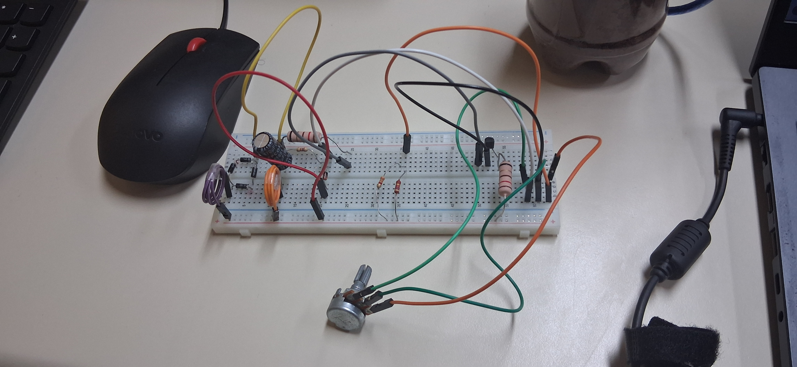
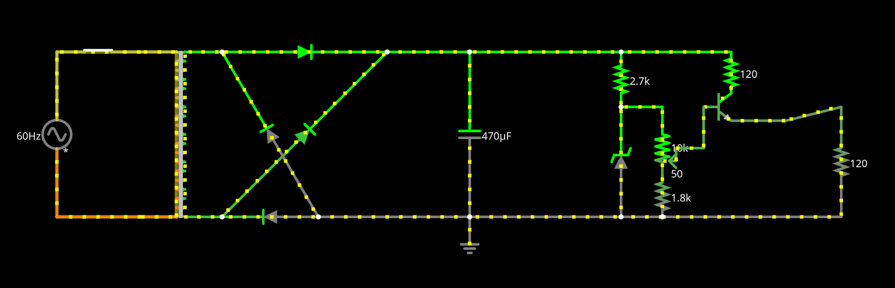
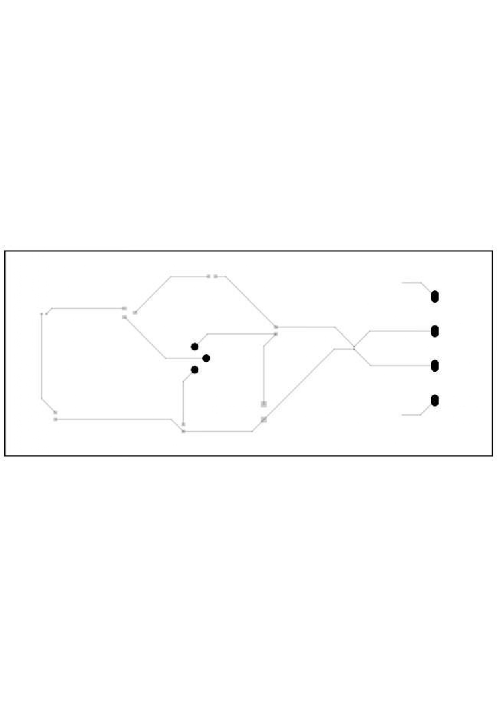

# Fonte de Tensão Ajustável
## Descrição da Atividade

Construção de uma fonte de tensão retificadora ajustável entre 3V e 12V com capacidade de 100mA. 

O circuito será feito a partir de uma corrente alternada de 127V (pico de 180V) de 60Hz.

## Alunos

* Bruno Kioshi Otani - 16858174

* Luis Aires Coimbra - 15472565

## Tabelas de Gastos

| Quantidade | Componente | Descrição | Valor Unitário |
|----------|----------|----------|----------|
| 1 | Protoboard | 840 pontos de conexão | R$ 39,10 |
| 1 | Kit Jumper | Macho-Macho + Macho-Fêmea | R$ 28,89 |
| 1 | Capacitor | 470 uF | R$ 0,44 |
| 1 | Potenciômetro | 10 kΩ, 1W | R$ 7,00 |
| 1 | Resistor | 2,7 kΩ, 1W | R$ 0,40 |
| 1 | Resistor | 3,1 kΩ | R$ 0,12 |
| 1 | Resistor | 4.4 kΩ | R$ 0,12 |
| 1 | Resistor | 1 kΩ | R$ 0,14 |
| 2 | Resistor | 120 Ω | R$ 1,90 |
| 4 | Diodo Retificador | 1N4007 | R$ 0,20 |
| 1 | Diodo Zener | 13V, 1W | R$ 0,50 |
| 1 | Transistor | NPN BC338-25 | R$ 0,45 |

Valor Total: R$ 81,18

Agradecimentos a Pedro Paulo Coutinho Carvalho, José Fausto Vital Barbosa, Pablo Henrique Almeida Vieira, Roberto Brostel Barroso pela doação dos componentes.

## Funcionamento do Circuito Físico
### Circuito Físico

### Funcionamento
[Video do funcionamento](https://www.youtube.com/shorts/0k9i4BsKFmk)

## Vídeo Explicando o Circuito 
[Video explicando o circuito](https://www.youtube.com/shorts/LChxO8qmlZA)

## Circuito no Falstad

[Simulação do Circuito](https://www.falstad.com/circuit/circuitjs.html?ctz=DwYwlgTgBAZgvAIgIwKgFwM6IAwDpsEECsqYIiALAEz5ECcAzBRdkldgwBwMOogBGlKqgAOghBV5QAbhEQkoAW0zyApgFokKAHwAoKFGAAVKAA9E6gGwUokqlAb3LVCqngJspAHaVUEAIY4uEicIWGhEeHCUCAA9kF0iagA7mCISHTRINgWSLgMRKxc2EQUnBEA7HScfEjy+KxEpRVU9AyWPBpIrgD0egbA0ma5lti2jlCao1DOrrA4Ke4osHIIo6iK-qbS6ZyeffqGycMIU2Ozk9YzLm4LBwMAJicTdlBULuPR7tGK8cgAcixsL1+oYQM92J8HJDZrcJHwgoQKBVSDsPA1lhhVp4ZA9EAw8HRrBUKhQkCSKgwKtwQYdgMdzAh3jZXo4xnY4ftQcAnoyJhdmZ84T8-khAQRaQMGfiYR9ujZYfMPAh7oZeelmNcbPybkqRelxcCVdz1chNRcXo5hRtRYbJYZoIyKkR7BQiVBnU5de4cas2Fy6dKJDrtbK5j7jYGTq9WZCOUqAwMMCdNFROFD1O74xHVfSU2x068zkKE5GpSmsxMrCyraXc2gTvRXe6Lm7LJzRD5kKh+Kp0gQbYgHqoYP4AK4AGzQqGkvYsVAquE4FWwlmcVKoliQRCqc1n5HRliaLDK25CdHJnDoZaOJwuRDYM3KUAfXzu3KDlmf9-N3vfUcZUoFQ+NstQ7XMRAbQDNVfF8YIqdslWWTZ+0IUQ-kJOhCkIHCcMxCdEAAJVUDAwAwNB-C8EBVBvPNAMyOCbCIaYgPAj9o0tZtLBLHN2PoriXwY1i625R1KErAS2w7KBVgXAdc0-ECXgkti6QeRQoC8RREAAL2kWIp38ABzPskCkCMoDI9JcAqboCjTDI02wcpuA0FEZKwZVNMQaJ+DRMzaJ06MWxArMiWtJQ-j0gyKJMuAAoU4LuNbENVPLRlQNAoDbHCkSAPkGDH2yqS8oGMSEGynduOyxULL9PZE0MIyIXOD42RmZi0odO8lK9Fk9mkv12Foz9vw+T0wNK29GS-dNYImkreLpWIoFULtMRERBrDhUwyQ4UQFlBAYRBkBYoAwA82RvY7ToQKQLus9tcx6WJuRWtbfHOza1nDRBdqQfaoG+nRDhutEcQeiRGrB-FUEhvInu5F63tW9b3Iwb7tqVUwpG+4QjsME7wbhg8Aeuwnbvug88BKWjkd0YAenACA9CAA)

O resistor de 1.8 kΩ foi feito associando em paralelo resistores de 4.4 kΩ e 3.1 kΩ

## Cálculo dos Componentes

### Cálculos Preliminares

Saída de tensão para o capacitor: $30.9$ V

Razão testada do transformador: $5.5$

Pico de Tensão A/C: $180$ V

### Voltagem no Capacitor ($V_c$)

Com base na razão ($R$) do transformador e na voltagem da rede ($V_{A/C}$), podemos calcular a tensão de saída do transformador ($V_t$):

$R = \frac{V_{A/C}}{V_t}$ $\Rightarrow$ $V_t = \frac{180}{5.5}$  $\therefore$  $V_t = 32,72$

Como cada diodo gasta ~0,7V e a corrente passa por 2 diodos em um mesmo sentido, faremos:

$V_c = V_t - 2\cdot0,7$ 

Então temos a voltagem no capacitor:

$V_c = 31.32$ V

### Cálculo das Correntes

Vamos calcular as correntes a seguir com base na Primeira Lei de Ohm: $U = Ri$.

$i_{celular} = \frac{12,179}{120} \approx 101,49 mA$

$i_{zener} = \frac{31,32 - 13}{2700} \approx 6.78 mA$

$i_{potenciômetro} = \frac{31,32}{10.000 + 2.700 + 1.800} \approx 2.16 mA$

### Cálculo do Capacitância

Vamos usar a fórmula simples do Ripple do circuito para calcular qual deve ser a capacitância do capacitor. Para isso, vamos buscar um ripple de 10%.

Temos a fórmula:

$R_p = \frac{i}{f\cdot C}$  

Com base no simulador, temos uma corrente $i = 0,106 A$ passando pelo capacitor. Além disso, a frequência da rede é $f = 2\cdot 60 = 120$ Hz. Logo:

$\Rightarrow$  $0,1\cdot 30.9 = \frac{0,106}{120\cdot C}$

Portanto, conseguimos a capacitância que precisamos:

$C \approx 285.87$ $\mu F$

A capacitância mais próxima e maior que C que achamos foi de $470$ $\mu F$, então usamos ela.

### Desenho das trilhas do Circuito

 

